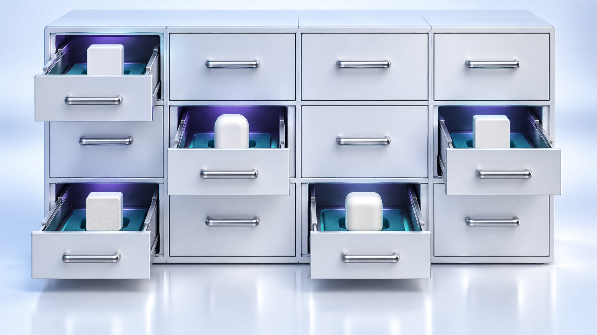
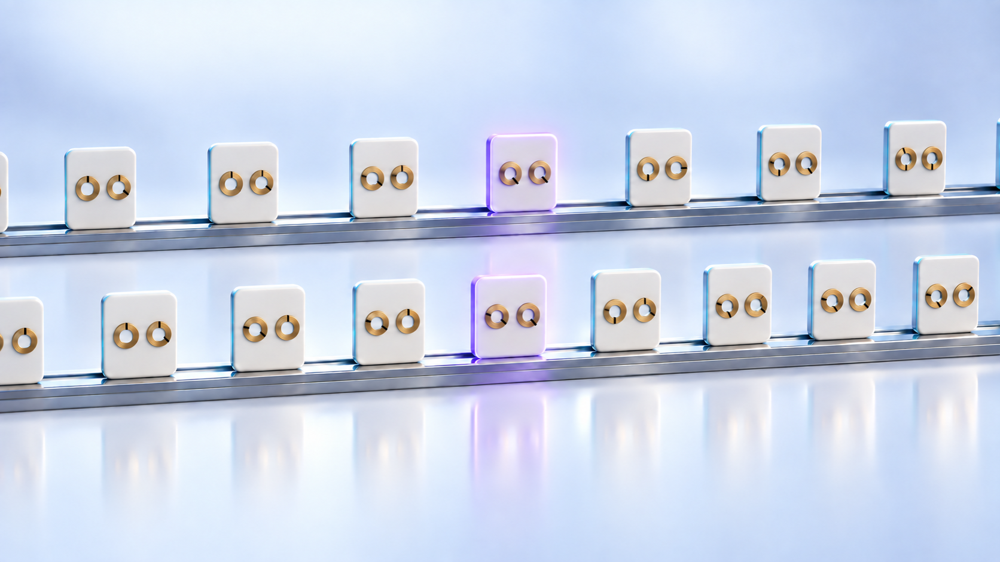

# vq ↔ vibe-qc version compatibility

vq is shipped as a subpackage of vibe-qc but carries its own version
line (`vibe-queue/pyproject.toml` + `src/vq/__init__.py`). This page
maps the two so you can answer "which vq did v0.X.Y of vibe-qc ship
with?" without spelunking the git log.

The queue ships ~5–10× more often than vibe-qc (small daemon /
CLI / hardening patches land continuously; vibe-qc tags are
milestone-paced). Pinning to a specific vq is rarely needed; pin to
a vibe-qc tag and you get the vq it shipped with.

## Why a separate vq version

Considered "use vibe-qc's version line for vq too" — rejected
because:

* vq's release cadence is ~10× vibe-qc's (50+ patches across the
  v0.6.x arc alone, vs. 8 vibe-qc patches over the same window).
  Stamping every vq commit with the current vibe-qc tag would lose
  per-patch granularity entirely.
* `vibe-queue/docs/roadmap_history.md` (through v0.9) and `CHANGELOG.md`
  (from v0.26.0) record per-vq-version history;
  cross-referencing it against vibe-qc tags via this matrix keeps
  the granular record useful.
* Operators that want a specific behaviour ("the v0.6.51
  `--depends-on` dispatch gate" / "the v0.7.0 agent protocol")
  can name it directly rather than via "the vibe-qc tag that
  included it."

Considered "split vq into its own git repo" — also rejected,
mostly for atomic-commit and drop-box-convention reasons (vq
features land based on what vibe-qc needs; splitting would force
two-repo coordination for trivially-coupled changes). vq stays in
the vibe-qc monorepo at `vibe-queue/`.

## Config shape across versions

### Console session-store transition (September 2026, unreleased)

The console now requires a private SQLite session record in addition to its
signed cookie. Existing stateless cookies require a new login; accounts and
passwords keep their format. Logout revocation and login counters are shared
only by workers using the same local store. Do not mix stateless and revocable
workers. A rollback or account-backup restore must stop the console and rotate
the signing secret so revoked sessions cannot return. See
[`fleet_console.md`](fleet_console.md#upgrade-rollback-and-backups) for details.

### General configuration compatibility

A fleet is mixed-version by construction: the driver runs the vq being
developed, the hosts run whatever the last rollout pinned. So the config file
is read by vq versions **older than the one that wrote it**, and how that read
fails is a fleet-availability question, not an ergonomics one.

Since v0.26.1 the rule is:

* **Unknown top-level keys are ignored, with one warning per process.** They
  are how a newer vq's additions look to an older one. Refusing the file
  instead — which is what `extra="forbid"` did until v0.26.1 — turns a key the
  host could not have used into a host that has no config at all.
* **Unknown keys inside a section are still fatal.** `[notifications]
  webhook_urls` is a typo, not a version skew, and silently disabling
  notifications is worse than a load error.
* **`min_vq_version` is the opt-out.** A config that sets it is refused by any
  older vq with the version it needs, named in the message.

The consequence for a change here: adding a top-level key is safe and needs
nothing. Adding one that must not be ignored — a `[multi_user]` policy input,
a repository the pin loader has to consult — means **raising `min_vq_version`
in the same commit**, because nothing infers it. An older vq cannot tell an
additive key from a load-bearing one; that judgement is the author's, and this
key is where it gets recorded.

## Mapping

Newest first. Released rows record the vq version stamped in
`vibe-queue/src/vq/__init__.py` at the moment the vibe-qc tag was cut. Rows in
the accepted-report era also match the committed fleet report unless the row
explicitly records a retracted report. A candidate row is explicitly labeled
and is not a release mapping until that tag and report exist. The "headline vq
features" column points at notable behaviour the operator might want to know
about; the full per-vq history is in [`roadmap.md`](roadmap.md).

| vibe-qc tag | vq version | codename | headline vq features in this ship |
|-------------|------------|----------|------------------------------------|
| v0.15.157 | 0.25.7 | *Neese's Cheetah* | Multi-k pure-DFT dense-core auto-tail (#518), fail-closed multipole far-field routing (#511), broker workflow projection (#347), and release-test artifact containment (#508). vq version retained from v0.15.156. |
| v0.15.156 | 0.25.7 | *Neese's Cheetah* | BIPOLE exact convergence confirmation includes DFT+U (#514 successor), and pbs-cluster branch-runtime updates no longer inherit the release tag (#535). |
| v0.15.149 | 0.25.6 | *Neese's Cheetah* | Incremental-Fock disengage gate (#129), UKS stability/determinant certification (#447/#474), and the bugctl ledger provenance repairs (#443/#124/#453/#458). vq unchanged. |
| v0.15.148 | 0.25.6 | *Neese's Cheetah* | Published DLPNO preset values and threshold provenance (#416/#417), selected-CI convergence contract (#107), molecular SCF max_iter validation (#392), Molden SCF-root preservation (#12). vq unchanged. |
| v0.15.147 | 0.25.6 | *Neese's Cheetah* | MSINDO 2-D Madelung basis-invariance (#187), PM7 core-radius parser repair (#224), citation-route gating (#442), vq admin test isolation (#438). vq unchanged. |
| v0.15.146 | 0.25.6 | *Neese's Cheetah* | Scheduler-kill false-green closed (#414), SECCM gap-guard restored under smearing (#422), measured k-route band edges/gaps (#426), CCM backend+parity-hold identity (#344). vq unchanged. |
| v0.15.145 | 0.25.6 | *Neese's Cheetah* | Pair-distance-correct semiempirical image selection (#316), GFN2 TM parameter projection (#43), fail-loud periodic k-route non-convergence (#342). vq unchanged. |
| v0.15.144 | 0.25.6 | *Neese's Cheetah* | slurm-cluster serial runtime-probe isolation (unfences scheduler rollouts), scoped-payload kernel-placement verification, and an input-hardening sweep across quota caps, drains, throttles, timeouts, pause clocks, and capacity snapshots. |
| v0.15.143 | 0.25.5 | *Neese's Cheetah* | Host-local scheduler failure containment, bounded timing inputs, correct unbounded log following, and crash-safe mixed-host legacy-rollout recovery. |
| v0.15.131 candidate (unreleased) | 0.25.0 | TBD at ship | Managed exact `vq self-update`, durable `admin recover-update`, legacy-rollout reconciliation, failure-atomic lifecycle transactions, and the v0.25 fleet-console configuration/authentication line. This becomes an exact mapping only after v0.15.131 is tagged and its accepted report exists. |
| v0.15.85-v0.15.130 | 0.24.0 | - | Accepted release reports pin the 0.24 fleet-rollout, exact-provenance, scheduler-runtime, and console baseline. |
| v0.15.81-v0.15.84 | 0.23.2 | - | Release-report mapping. |
| v0.15.79-v0.15.80 | 0.23.1 | - | Release-report mapping. |
| v0.15.78 | 0.23.0 | - | Release-report mapping. |
| v0.15.77 | 0.22.0 | - | Release-report mapping. |
| v0.15.76 | 0.21.3 | - | Release-report mapping. |
| v0.15.74-v0.15.75 | 0.21.2 | - | Release-report mapping. |
| v0.15.72-v0.15.73 | 0.21.1 | - | Release-report mapping. |
| v0.15.68-v0.15.71 | 0.21.0 | - | Release-report mapping. |
| v0.15.67 | 0.20.2 | - | Release-report mapping. |
| v0.15.66 | 0.20.1 | - | Release-report mapping. |
| v0.15.65 | 0.20.0 | - | Release-report mapping. |
| v0.15.64 | 0.19.1 | - | Release-report mapping. |
| v0.15.63 | 0.19.0 | - | Release-report mapping. |
| v0.15.62 | 0.18.1 | - | Tag source stamp. Its fleet report was retracted because it relied on a `main` pipeline while the release-gate pipeline failed, and cannot be regenerated as accepted evidence. |
| v0.15.61 | 0.18.0 | - | Release-report mapping. |
| (main history) | 0.8.10 | *Tarjan's Bridge* | Remote `--chain` + `--rerun-until` forwarding. `submit_remote` now accepts `chain`, `rerun_until_file_exists`, `rerun_max` and emits them on the remote argv — same single-roundtrip pattern v0.7.11 established for `--array`. Closes the v0.8.7/v0.8.8 local-only gap so NEB / DFT+U workflows run on compute-d / compute-a. Mutex with `--array` validated client-side. `--rerun-max` only forwarded when != default (10) to keep argv compact. 9 new tests; suite at 2165 / 11 skipped. |
| (main history) | 0.8.9 | *Cook's Hierarchy* | `vq audit` CLI verb — surfaces the v0.8.6 `rpc-audit.jsonl` from the command line with `--since` / `--uid` / `--method` (incl. prefix glob) / `--tail` / `--json` filters. Composable for forensic queries. `vq audit HOST` SSH-delegates; `vq audit --all-hosts` fans out via v0.7.6. No new daemon surface — reads the existing on-disk audit log. 16 new tests; suite at 2156 / 11 skipped. |
| (main history) | 0.8.8 | *Turing's Halt* | `vq submit --rerun-until FILE` — convergence-flag auto-resubmit. Daemon checks the flag path on every COMPLETED transition (with `$VQ_WORKDIR` substituted); if absent and `rerun_count < rerun_max` (default 10), spawns a clone with `rerun_count++` and `depends_on=[this jobid]`. FAILED jobs don't trigger reruns. Use case: DFT+U self-consistency (script writes CONVERGED when U converges), NEB CI (NEB_CONVERGED when force-tol met). Composes with v0.8.7 `--chain N` for "N images each iterating to tolerance." 12 new tests; suite at 2124 / 11 skipped. |
| (main history) | 0.8.7 | *Hoare's Triple* | `vq submit --chain N` — spawn N near-identical jobs in strict sequence (each `depends_on` the prev). NEB image-by-image, DFT+U self-consistency iteration. Spec gains `chain_index` / `chain_total` / `chain_group_id`; daemon injects `VQ_CHAIN_*` env vars at dispatch. Cascade-fail inherits the `--depends-on` semantic. Mutually exclusive with `--array` (different abstraction: array = parallel siblings, chain = strict sequence). 13 new tests; suite at 2112 / 11 skipped. |
| (main history) | 0.8.6 | *Codd's Audit* | Multi-user RPC audit-trail. New `vq/audit.py` module appends one JSON-Lines entry to `rpc-audit.jsonl` for every `set_*` call (admin-status, drain, throttle). Schema: `{ts, method, uid, ok, args_summary, error?}`. Caller's uid via `SO_PEERCRED` on Linux (`null` on macOS). Reads not logged (high-volume + not sensitive). Failed calls still audit (the failure itself is forensic). Tokens never in args_summary. Multi-user path mapping mirrors v0.8.1. 18 new tests; suite at 2099 / 11 skipped. |
| (main history) | 0.8.5 | *Knuth's Concrete* | Mirror of v0.8.3's fan-out for the mutating verbs. `vq drain --all` sets/releases/status'es drain across every configured host in parallel; `vq throttle --all-hosts` does the same for persistent-throttle ops. Per-job throttle is rejected with `--all-hosts` (jobids are host-local). Local arm calls drain/throttle module primitives directly (skips a `vq` subprocess for the local host). 13 new tests; suite at 2081 / 11 skipped. |
| (main history) | 0.8.4 | *Brooks's Mythical* | New built-in `get_methods()` RPC returns the registered method list + daemon version + multi-user flag. Forward-compat probe: clients ask the daemon what it supports before calling. `vq daemon ping --verbose` (`-v`) surfaces it; envelope gains a `methods` field. Pre-v0.8.4 daemons lacking get_methods land `methods=null` so clients distinguish "didn't ask" from "told nothing". Built into RPCServer constructor next to `ping`. 8 new tests; suite at 2068 / 11 skipped. |
| (main history) | 0.8.3 | *Dijkstra's Shortest* | `vq daemon ping` extended to remote hosts (`vq daemon ping HOST`) and parallel fleet-wide (`vq daemon ping --all`). Reuses the v0.7.6 fan-out + the existing `_aggregate_per_host_json` JSON shape so monitoring scripts see the same envelope they already know. v0.8.2 verb body refactored into `_local_daemon_ping` + `_format_ping_text` helpers so the JSON envelope is the single source of truth. 6 new tests; suite at 2060 / 11 skipped. |
| (main history) | 0.8.2 | *Lamport's Logical* | `vq daemon ping` CLI verb — small, fast probe distinct from `vq daemon status` (pidfile-based) and `vq daemon health` (heavy lifecycle audit). Uses the v0.8.0 RPC: returns `{ok, version, multi_user, socket_path, latency_ms, error}` with `--json`. Exit codes 0/1/2 (reachable / no-socket / protocol-error) are stable for monitoring scripts. Local-only first pass. 7 new tests; suite at 2054 / 11 skipped. |
| (main history) | 0.8.1 | *Karp's Reduction* | extends the v0.8.0 RPC pattern to `drain.json` and `throttle.json` — the other two daemon-state files affected by the v0.7.12 XDG split. drain.json pre-v0.8.1 had NO multi-user path mapping (admin-user CLI wrote `~/.local/share/vq/drain.json` while root daemon read `/var/lib/vq/drain.json` — drain never reached dispatch in multi-user); throttle.json still required `sudo` for writes. New methods: `get_drain_state` / `set_drain_state` / `get_throttle_state` / `set_throttle_state` (reads open, writes admin-token gated in multi-user). 27 new RPC tests; suite at 2047 / 11 skipped. |
| (main history) | 0.8.0 | *Dahl's Simula* | daemon-side RPC for admin-status. Closes the v0.7.12 user-XDG vs daemon-XDG split footgun via new `vq/rpc.py` module (Unix-socket, line-delimited JSON, ping + get/set_admin_status methods). Single-user 0600, multi-user 0660 admin-group, token-gated writes. Fallback to direct file when daemon down (silent single-user, WARNING multi-user). Minor-version bump marks the architectural fence. |
| (main history) | 0.7.18 | *Kay's Object* | new `vq overview --recommend` flag ranks reachable + healthy + non-drained hosts by `running_cpus + pending_cpus` workload (ascending) and prints the best single host name. Composes with shell: `vq submit $(vq overview --recommend) my.py`. Exits non-zero when no host qualifies. |
| (main history) | 0.7.17 | *Postel's Robustness* | webhook `notify_on_states` filter. NotificationConfig gains a state filter that defaults to "fire on every terminal" (backward-compat) but narrows to e.g. "alert only on failure" with one TOML list. Validation at config load (unknown states rejected, case-normalised, deduped). |
| (main history) | 0.7.16 | *Codd's Tuple* | new `vq submit --time-limit HH:MM:SS` (alias `--time`) ergonomic SLURM-style flag. Sets the same `wall_time_seconds` spec field as `--wall-time-seconds`; the two are mutually exclusive. Accepts HH:MM:SS, MM:SS, or plain integer seconds. |
| (main history) | 0.7.15 | *Shannon's Entropy* | cross-user resource cap tripwire. 6 new tests pinning the operator-stated invariant that the daemon's global `cpus_total` cap sums across all submitters' jobs (per-user quotas can tighten further but never loosen). No production code changes — existing enforcement verified correct. |
| (main history) | 0.7.14 | *Hamming's Code* | multi-user test coverage audit (secondary half of v0.7.13). 8 new tests pinning multi-user-specific codepaths across v0.7.7–v0.7.11 ships: cross-user spec resolution, --depends-on-any submitter-scope validation, admin-status path baseline, cross-user list_jobs + collapse-arrays, remote --array wire shape multi-user neutrality. No production code changes. |
| (main history) | 0.7.13 | *Backus's Form* | round-3 hardening + coverage audit. 9 new tests filling edge-case gaps across the v0.6.18 → v0.7.12 ships (DNS-failure handling, KeyboardInterrupt propagation, JSON aggregation non-dict results, archived-spec workdir fetch, afterany INTERRUPTED tripwire, reset-branch fetch-failure SHA preservation, collapse-array boundaries, remote --array wire-shape backward compat). No production code changes. |
| (main history) | 0.7.12 | *Wirth's Modula* | docs-only ship: new `docs/state_file_audit.md` catalogues every state-file path, env-var precedence, and known gotchas (including the v0.7.1-flagged user-XDG vs daemon-XDG `admin-status.json` split). Contract surface for a future unification ship. |
| (main history) | 0.7.11 | *Stroustrup's Stencil* | remote `vq submit --array N` does ONE ssh roundtrip + ONE source upload (pre-v0.7.11 looped N of each on the laptop). Remote array elements now share an `array_group_id`, closing v0.6.52's "no remote group id" limitation. `submit_remote` returns `list[str]` uniformly. |
| (main history) | 0.7.10 | *McCarthy's List* | new `vq queue --collapse-arrays` flag folds every `--array N` group into a single `ARRAY 5P/25C/30 gid=...` row with a compact per-state breakdown. Composes with existing filters; the fold runs AFTER state filtering. |
| (main history) | 0.7.9 | *Liskov's Substitution* | new `vq admin reset-branch ENV [HOST] --yes` auto-fix verb snaps a managed env's working tree to `origin/<configured-branch>` via `git fetch + git reset --hard`. Closes the v0.7.1 slip on the compute-d branch-drift incident. |
| (main history) | 0.7.8 | *Knuth's Schedule* | new `vq submit --depends-on-any JOBID` adds SLURM afterany semantics alongside v0.6.51's `--depends-on` (afterok). Dependent dispatches once every predecessor terminates regardless of outcome; predecessor failure does NOT cascade-fail. |
| (main history) | 0.7.7 | *Cerf's Datagram* | new `vq fetch --workdir JOBID` verb pulls the per-job scratch workdir (`$VQ_WORKDIR`, v0.6.54) back to the laptop. Mirrors workspace-fetch shape; lands at `<jobname>-<jobid>-workdir/`. |
| (main history) | 0.7.6 | *Tanenbaum's Mailbox* | parallel fan-out for every `--all` / `--all-hosts` verb (`admin status`, `update`, `auto-update`, `audit-recovery`) via `ThreadPoolExecutor`. `VQ_FANOUT_SERIAL=1` / `VQ_FANOUT_WORKERS=N` escape hatches. |
| (main history) | 0.7.5 | *Hopper's Compiler* | 3-tier host recovery channels contract + `vq admin audit-recovery` verb + `contrib/setup-recovery-channels.sh` bootstrap. Every new fleet host must satisfy the contract before joining. |
| (main history) | 0.7.4 | *Ritchie's Pipe* | per-env `auto_update_policy = "branch"` config knob makes `vq admin auto-update` track `origin/<branch>` SHA drift (alongside the existing `tag` policy) |
| (main history) | 0.7.3 | *Dijkstra's Semaphore* | `ssh BatchMode=yes` on every transport call — unreachable hosts fail fast inline instead of hanging `--all` aggregations on a password prompt |
| (main history) | 0.7.2 | *Engelbart's Demo* | `vq admin status` shows pyproject `[project] version` in the new VERSION column (replaces misleading `git describe` DESCRIBE column) |
| (main history) | 0.7.1 | *Lamport's Clock* | operator-visibility hardening on `vq admin update`: post-update branch validation, persisted update_script_output tail surfaced via `--verbose`, `--update-script-arg` pass-through, `vq admin mark-ok` escape hatch, opt-in `fail_on_dirty` per-env policy, `vq admin update --show-output` |
| (main history) | 0.7.0 | *Hoare's Pipeline* | per-job workdir + agent protocol (v0.6.54); `vq logs` (v0.6.50); job dependencies (v0.6.51); array jobs (v0.6.52); fleet auto-update (v0.6.49); admin-token gate on auto-update (v0.6.48); array-group queue filter (v0.6.53) |
| v0.9.1      | 0.6.39     | — (queue codenames begin at v0.7.0) | Round-2 multi-user hardening — daemon auto-cleanup multi-user-aware |
| v0.9.0      | 0.6.39     | — | (same as v0.9.1) "Knowles's Kingfisher" |
| v0.8.3      | 0.6.2      | — | early multi-user backbone + lifecycle state machine |
| v0.8.2      | 0.6.2      | — | (same) |
| v0.8.1      | 0.6.2      | — | (same) |
| v0.8.0      | 0.6.2      | — | (same) "Grimme's Gecko" |
| v0.7.14     | 0.0.1      | — | initial vq scaffolding |
| (older)     | not shipped | — | vibe-qc pre-dates the vq subpackage |

## v0.7.x onward — codename convention

The vq subpackage starts using codenames at **v0.7.0**, drawing from
**computer-science pioneers** (distinct from vibe-qc's
chemistry/physics scientists like Löwdin, Pulay, Grimme,
Knowles). Same `[surname]'s [object]` shape vibe-qc uses, so the
two systems' release notes stay culturally adjacent.

Tracker for picked + reserved names:

| vq version | codename | theme link |
|------------|----------|------------|
| v0.7.0     | *Hoare's Pipeline* | Tony Hoare, CSP — academic foundation for "async processes communicating through queues," exactly the multi-chat coordination model v0.6.54 made explicit. |
| v0.7.1     | *Lamport's Clock* | Leslie Lamport's 1978 paper on distributed event ordering — single instantaneous readings (`LAST OK=False`) are insufficient; you need the causal chain. The ship records the chain for `vq admin update`. |
| v0.7.2     | *Engelbart's Demo* | Doug Engelbart's 1968 *Mother of All Demos* — show the human what's actually on the machine. `vq admin status` finally reports the project's real semver instead of stale `git describe` output. |
| v0.7.3     | *Dijkstra's Semaphore* | Edsger Dijkstra's foundational synchronization work — every wait is bounded. v0.7.3 applies that discipline to vq's ssh/scp transport via `BatchMode=yes`. |
| v0.7.4     | *Ritchie's Pipe* | Dennis Ritchie's Unix pipes — composable stream feeds. v0.7.4 makes `auto-update` a pipe from `origin/<branch>` to the local env. |
| v0.7.5     | *Hopper's Compiler* | Grace Hopper's compilers — check the source before you commit to running it. v0.7.5 audits host recovery channels before trusting them to the fleet. |
| v0.7.6     | *Tanenbaum's Mailbox* | Andrew S. Tanenbaum's distributed systems / operating systems textbooks — the mailbox is the canonical message-passing concurrency primitive. v0.7.6 parallelizes per-host fan-out: each thread sends to its host's "mailbox" (the ssh transport) and `as_completed()` rendezvous picks results up as they land. |
| v0.7.7     | *Cerf's Datagram* | Vint Cerf co-invented TCP/IP, the foundation of "reliably transfer arbitrary data between two machines." `vq fetch --workdir` is the highest-level operator-facing instance of that contract in vq — pull bytes off a remote scratch dir, land them locally as a faithful copy, regardless of which side the job ran on. |
| v0.7.8     | *Knuth's Schedule* | Donald Knuth's TAOCP devotes Volume 1 to coroutines and Volume 3 to sorting/searching, with extensive treatment of scheduling problems throughout. The dispatch gate's "all-predecessors-success AND all-predecessors-terminal" conjunction is a textbook job-scheduling predicate; v0.7.8 adds the afterany half of the literal SLURM scheduler's predicate vocabulary. |
| v0.7.9     | *Liskov's Substitution* | Barbara Liskov's substitution principle — anything a downstream consumer expects of "the env on branch X" continues to hold after the reset-branch verb substitutes the working tree with the canonical upstream form. The verb literally enforces LSP for the env's branch contract. |
| v0.7.10    | *McCarthy's List* | John McCarthy invented LISP and made the list the fundamental data structure of programming. The collapsed array row IS a list rendered as one row — and naming the predicate `collapse_arrays=True` makes the fold's homoiconicity explicit (the input list, the per-group list, and the rendered summary are all just views over the same sequence). |
| v0.7.11    | *Stroustrup's Stencil* | Bjarne Stroustrup, C++. A "stencil" in C++ idiom is a template overlaid N times — exactly what `--array N` does at submission: one template (the source upload), N stamped specs. The single-roundtrip optimization makes the stenciling actually look like stenciling at the wire level. |
| v0.7.12    | *Wirth's Modula* | Niklaus Wirth's Modula language made "explicitly export every interface" foundational. The state-file audit doc explicitly enumerates every path vq touches — the export interface for the path layout, the way each `MODULE` in Modula explicitly listed what it exposed. |
| v0.7.13    | *Backus's Form* | John Backus + BNF (Backus-Naur Form). BNF made grammar explicit — every production rule written down, no implicit fallbacks. The round-3 audit makes each module's contract surface explicit by pinning the edge-case branches the regular test files take for granted. |
| v0.7.14    | *Hamming's Code* | Richard Hamming's error-correcting codes — the parity bits that catch silent corruption in seldom-exercised codepaths. The multi-user tests are vq's equivalent: the seldom-exercised paths the operator touches only when the daemon's running as root with [multi_user] enabled, exactly the scenario where a quiet regression would go unnoticed longest. |
| v0.7.15    | *Shannon's Entropy* | Claude Shannon's information theory — channel capacity is a hard upper bound on throughput regardless of who's transmitting. The host's `cpus_total` is vq's channel capacity; the global dispatch cap enforces that parallel jobs across users can never exceed it. |
| v0.7.16    | *Codd's Tuple* | Edgar Codd's relational model distinguished the underlying tuple (row) from any particular view over it. `wall_time_seconds` is the spec field (tuple column); `--wall-time-seconds` and `--time-limit / --time` are two views over the same column. Codd would be amused that they differ only in human ergonomics. |
| v0.7.17    | *Postel's Robustness* | Jon Postel's "be conservative in what you send" half of the robustness principle. The notify_on_states filter implements exactly that — the operator narrows the webhook stream to what they actually want to hear, instead of every terminal-state ping. |
| v0.7.18    | *Kay's Object* | Alan Kay, OO — "objects hide their state and expose behavior." The recommend verb hides the ranking algorithm behind a single value the operator composes with via shell substitution. The chooser doesn't need to know what the daemon's load looks like; the verb encapsulates that. |
| v0.8.0     | *Dahl's Simula* | Ole-Johan Dahl co-invented Simula (the first OO language). Simula introduced encapsulating state behind a process-like object boundary — which is exactly what the RPC does for `admin-status.json`. Dahl's name on a ship that adds the first true IPC boundary to vq is on-theme. |
| v0.8.1     | *Karp's Reduction* | Richard Karp's polynomial reductions show that once you solve one canonical NP-complete problem, the others reduce to it. v0.8.0 *Dahl's Simula* was vq's canonical "daemon-mediated state file" pattern; v0.8.1 reduces `drain.json` and `throttle.json` to that same already-solved shape — no new architecture, just the proof that the v0.8.0 design pays off the moment a second state file shows up. |
| v0.8.2     | *Lamport's Logical* | Leslie Lamport's logical clocks are the foundation of distributed-system "did A happen before B" reasoning — and the canonical way to answer that is "send a message and see what comes back." `vq daemon ping` is exactly that probe: send the smallest possible message, observe the response (or absence). Lamport's name on the verb that gives the v0.8.x RPC its first user-facing reach is on-theme. |
| v0.8.3     | *Dijkstra's Shortest* | Edsger Dijkstra's shortest-path algorithm: reduce a new problem to a sequence of cheapest moves over an existing graph. v0.8.3 takes `vq daemon ping` from one host to N hosts by reducing to *already-existing* primitives — `_delegate_to_remote` for SSH, `_aggregate_per_host_json` for the fan-out, `_local_daemon_ping` for the local leaf. No new plumbing; the verb just walks shortest paths through the v0.7.6+v0.8.2 graph. |
| v0.8.4     | *Brooks's Mythical* | Brooks's *Mythical Man-Month* + "No Silver Bullet" — about the fundamental difficulty of building software when you don't know what your tools actually do. `get_methods()` is the queue's small answer to that: ask the daemon what it supports before you build on top of it. Brooks's name on the introspection ship is on-theme. |
| v0.8.5     | *Knuth's Concrete* | Donald Knuth + "Concrete Mathematics" — applying tools you already have to new but isomorphic problems. v0.8.3 fanned `vq daemon ping` out to the fleet; v0.8.5 fans `vq drain` and `vq throttle` out using the same fan-out, just bound to mutating verbs instead of read-only ones. Pure pattern reuse, no new transport — concrete in the Knuth sense. |
| v0.8.6     | *Codd's Audit* | Edgar Codd's relational discipline was that every data fact should be record-able and queryable, not implicit in code paths. v0.8.6's audit trail makes the queue's mutating ops into first-class records: who did what when, on durable storage, queryable independently of the system that produced them. Codd's name on the audit-trail capstone fits the v0.8.x architectural arc. |
| v0.8.7     | *Hoare's Triple* | Tony Hoare's triples `{P} S {Q}` describe imperative programs as chains of pre→stmt→post implications. `--chain N` is the operational analogue: N steps where each step's post-condition (success) is the next step's precondition. Cascade-fail enforces the contract — if step k violates its post, step k+1 doesn't get to assume its precondition. Hoare's name on the chain ship reads as the queue's Hoare logic in action. |
| v0.8.8     | *Turing's Halt* | The halting problem: given a program, will it terminate? `--rerun-until FILE` is the queue's pragmatic answer — "iterate until the script writes its convergence flag, with a safety cap so a non-converging loop doesn't run forever." Turing's name on the convergence ship reads as the practical engineering response to the theoretical impossibility. |
| v0.8.9     | *Cook's Hierarchy* | Stephen Cook's polynomial hierarchy classifies decision problems by the number of alternating quantifiers needed to express them. `vq audit` is the operator's flat-language tool for asking those questions of the queue's history: "is there a uid such that for all methods such that since 6h ago..." Each filter is a quantifier; composition gives the hierarchy. Cook's name on the verb that opens the audit log to ad-hoc querying is on-theme. |
| v0.8.10    | *Tarjan's Bridge* | Robert Tarjan's bridge-finding algorithm identifies the edges whose removal disconnects a graph — the critical "bridge" links. The SSH transport is the bridge between the laptop and the fleet; v0.8.10 extends the v0.8.7+8 primitives (`--chain`, `--rerun-until`) across that bridge so NEB / DFT+U workflows reach remote hosts. Tarjan's name on the ship that closes the bridge across the v0.8.x local-only gap is on-theme. |
| v0.8.11 onward | see the catalog | The rationale rows above stop here. Every name from v0.8.11 to v0.25.0 lives in [`src/vq/codename.py`](../src/vq/codename.py); this table is kept for the reasoning behind the early picks, not as an index. |

**`src/vq/codename.py` is the source of truth.** `RELEASE_CODENAMES` is what
`vq --version` reads, and `codename_for_version()` implements the inheritance
rules: an explicit `X.Y.Z` entry wins, an unlisted patch inherits its parent
minor, and a PEP 440 `.devN` / `aN` / `bN` / `rcN` build resolves to the
release it is heading toward. Add a minor's entry in the same commit that
bumps `pyproject.toml` and `__init__.py`; `tests/test_codename.py` fails the
suite if a version ships without one, or if the minor sequence develops a gap.

Names are settled at ship time: vq codenames track the *thematic substance*
of the ship. The v0.27.0–v0.33.0 forward entries are provisional proposals,
not reservations; re-confirm each name against the delivered concept before
tagging its release.

**The v0.13.0 to v0.25.0 names are a backfill**, proposed and approved on
2026-09-09. The series lapsed after v0.12.0 while vq went on to 0.25.7, so thirteen
minor lines shipped unnamed; the names were reconstructed from the monorepo's
own version-bump commits rather than invented. Two earlier lines were resolved
in the same pass, because names had been attached to feature bullets rather
than to releases: v0.11.0 carried four candidates and resolves to *Eager's
Sharing*, v0.12.0 carried five and resolves to *Hopper's Bug*. The unpicked
names stay in [`STATUS.md`](STATUS.md) as the per-feature labels they always
were; they are not alternative release names. See
[`.release-status/CODENAME-PROPOSAL.md`](../.release-status/CODENAME-PROPOSAL.md)
for the reasoning behind each.

## Minor-release artwork

The [release gallery](codenames.md) presents the complete series together.
Each image below belongs to a minor line; patch releases inherit it.

### v0.7.0 — Hoare's Pipeline

Per-job working directories isolate each task within the agent protocol.

<figure class="codename-art">

</figure>

### v0.8.0 — Dahl's Simula

Daemon-mediated RPC gives administrative state an explicit process boundary.

<figure class="codename-art">

</figure>

### v0.9.0 — Tukey's Window

The live vq top view brings one window of job resource activity into focus.

<figure class="codename-art">

</figure>

### v0.10.0 — Lampson's Hint

Advisory host availability uses vq host down/up to guide dispatch.

<figure class="codename-art">

</figure>

### v0.11.0 — Eager's Sharing

Host pools and a default pool organize how work is shared across machines.

<figure class="codename-art">

</figure>

### v0.12.0 — Hopper's Bug

Tracing a failure back to its cause makes the queue diagnosable.

<figure class="codename-art">

</figure>

### v0.13.0 — Gray's Log

The job lifecycle timeline records ordered transitions and pending reasons.

<figure class="codename-art">

</figure>

### v0.14.0 — Needham's Principal

Identity checks distinguish the principal behind a driver operation.

<figure class="codename-art">

</figure>

### v0.15.0 — Schroeder's Authority

Dispatch stops are attributed to the authority holding them in place.

<figure class="codename-art">

</figure>

### v0.16.0 — Sutherland's Sketchpad

The first fleet console views connect a cross-host overview to live job detail.

<figure class="codename-art">

</figure>

### v0.17.0 — Corbató's Password

Console accounts and sessions distinguish authenticated access.

<figure class="codename-art">

</figure>

### v0.18.0 — Abadi's Delegation

Delegated administration carries authority across a fleet rollout.

<figure class="codename-art">

</figure>

### v0.19.0 — Merkle's Hash

Exact-SHA release evidence binds rollout decisions to content-addressed reports.

<figure class="codename-art">

</figure>

### v0.20.0 — Herlihy's Wait-Free

Scheduler runtime updates proceed without draining or waiting for running work.

<figure class="codename-art">

</figure>

### v0.21.0 — Kilburn's Page

One program name maps to separate runtime slots for different source revisions.

<figure class="codename-art">

</figure>

### v0.22.0 — Little's Law

The concurrency quota becomes visible in vq overview.

<figure class="codename-art">

</figure>

### v0.23.0 — Saltzer's Binding

The runtime_slot_root setting makes runtime placement an explicit binding.

<figure class="codename-art">

</figure>

### v0.24.0 — Cheney's Semispace

Build beside the live runtime, switch on success, and reclaim the old space.

<figure class="codename-art">

</figure>

### v0.25.0 — Härder's Atomicity

Managed self-update preserves recoverable state across lifecycle transactions.

<figure class="codename-art">

</figure>

### v0.26.0 — Raymond's Bazaar

Licensing, security, contributor guidance and documentation make vq publishable.

<figure class="codename-art">

</figure>

### v0.27.0 — Fidge's Timestamp (provisional)

Provisional concept: logical ordering across hosts without a shared timepiece.

<figure class="codename-art">

</figure>

### v0.28.0 — Mattern's Cut (provisional)

Provisional concept: a consistent snapshot across independently running hosts.

<figure class="codename-art">

</figure>

### v0.29.0 — Braden's Requirements (provisional)

Provisional concept: accept varied inputs while emitting a strict, uniform form.

<figure class="codename-art">

</figure>

### v0.30.0 — Bloom's Filter (provisional)

Provisional concept: probabilistic membership checks for deduplication and idempotency.

<figure class="codename-art">

</figure>

### v0.31.0 — Stonebraker's Vacuum (provisional)

Provisional concept: reclaim dead space through archiving and automatic cleanup.

<figure class="codename-art">

</figure>

### v0.32.0 — Brewer's Partition (provisional)

Provisional concept: tolerate a network split while each side keeps operating.

<figure class="codename-art">

</figure>

### v0.33.0 — Erlang's Blocking (provisional)

Provisional concept: counted permits enforce admission and concurrency limits.

<figure class="codename-art">

</figure>

## Updating this matrix

When the release chat cuts a new vibe-qc tag:

```sh
# At repo root, AFTER the tag exists:
git show <new-tag>:vibe-queue/src/vq/__init__.py
# → __version__ = "0.X.Y"
```

Add a row to the table above (newest first). The queue chat or
the release chat can do this; whoever notices the gap fixes it.

The "headline features" column is summary-style — link the
roadmap rather than re-explaining. Keep this doc short.
